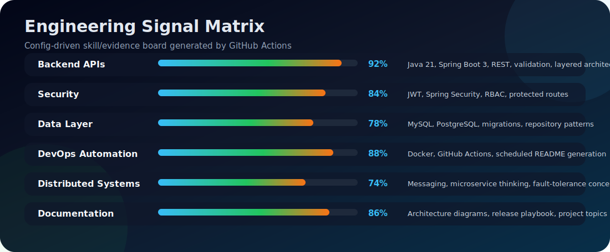
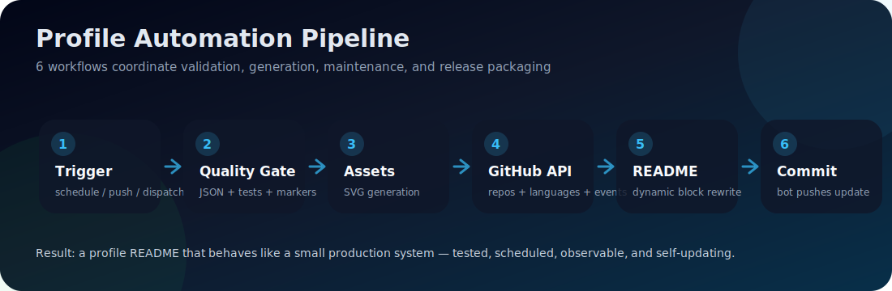

<div align="center">


[](https://git.io/typing-svg)


[](https://www.linkedin.com/in/sachith-asmadala-3b185a333/)
[](https://github.com/Sachith-02)


</div>

---

<div align="center">

### 🧭 Profile Navigation

[About](#-about-me) • [Live Snapshot](#-live-engineering-snapshot) • [Actions](#%EF%B8%8F-github-actions-control-center) • [Engineering Matrix](#-engineering-matrix) • [Languages](#-language-intelligence) • [Projects](#-featured-engineering-projects) • [Activity](#-recent-public-activity) • [Architecture](#-automation-architecture)

</div>

---


<!-- ABOUT_ME_START -->
## 👋 About Me

I am **Sachith Asmadala**, a **Backend Engineer \| Java · Spring Boot · Distributed Systems** from **Sri Lanka**. This section refreshes automatically from my public GitHub account, repository metadata, languages, and recent activity.

> BSc(Hons) in Computer Science - Undergraduate @Sllit

- 🔭 GitHub signal: **12 public repositories**, **5 original projects**, **15 stars**, **0 forks**, and **5 followers**
- 🧠 Main language signal: **Python, C, Java, Yacc**
- 🚀 Strongest active project: **[LibraCore](https://github.com/Sachith-02/LibraCore)** — LibraCore is a secure, production‑style library and asset management backend built with Java 21, Spring…
- 🕒 Most recently updated project: **[devops-assistant-test-projects](https://github.com/Sachith-02/devops-assistant-test-projects)** · Jun 02, 2026
- ⚡ Latest public activity: 🧩 [Pushed 0 commits](https://github.com/Sachith-02/Autonomous-Infrastructure-Provisioning-and-Delivery-via-Agentic-AI) to `main` in [`Sachith-02/Autonomous-Infrastructure-Provisioning-and-Delivery-via-Agentic-AI`](https://github.com/Sachith-02/Autonomous-Infrastructure-Provisioning-and-Delivery-via-Agentic-AI) · Jun 05, 2026
- 🎯 Current focus: Java 21 and Spring Boot 3 production backend design; JWT authentication, role-based access control, and REST API security; Dockerized deployment, CI/CD, and GitHub Actions automation

```java
record Developer(String focus, String githubSignal, String currentProject) {}

var sachith = new Developer(
    "Java 21 and Spring Boot 3 production backend design",
    "5 original projects · 15 stars · 5 followers · 5 following",
    "LibraCore"
);
```

<sub>🤖 Auto-updated by GitHub Actions from the GitHub API. Last generated: **2026-06-15 21:19 UTC**.</sub>

<!-- ABOUT_ME_END -->

<br clear="right"/>

---

<!-- FOCUS_AREAS_START -->
## 🎯 Professional Focus

> Clean, recruiter-friendly summary of what this portfolio is trying to prove.

| Focus area | What I am building toward | Signal |
|---|---|---|
| **Backend APIs** | Build maintainable service layers, REST APIs, and database-backed workflows. | `Java · Spring Boot · SQL` |
| **Automation** | Use GitHub Actions and Python scripts to remove repeated manual work. | `Actions · Python` |

<!-- FOCUS_AREAS_END -->

---

<!-- PROFILE_SUMMARY_START -->
## 🧠 Live Engineering Snapshot

> This block is automatically regenerated by GitHub Actions from live GitHub API data.

| Metric | Value |
|---|---:|
| Public repositories scanned | **12** |
| Original projects | **6** |
| Forked projects | **6** |
| Total stars | **39** |
| Total forks | **0** |
| Most used languages | **Python, C, Java, Yacc, Lex** |
| Automation mode | **Daily schedule + manual workflow dispatch** |
| Last automation run | **2026-06-15 21:19 UTC** |


<!-- PROFILE_SUMMARY_END -->

---

<!-- ENGINEERING_MATRIX_START -->
## 🧬 Engineering Matrix



| Area | Signal | Evidence |
|---|---:|---|
| **Backend APIs** | `███████████░` **92%** | Java 21, Spring Boot 3, REST, validation, layered architecture |
| **Security** | `██████████░░` **84%** | JWT, Spring Security, RBAC, protected routes |
| **Data Layer** | `█████████░░░` **78%** | MySQL, PostgreSQL, migrations, repository patterns |
| **DevOps Automation** | `███████████░` **88%** | Docker, GitHub Actions, scheduled README generation |
| **Distributed Systems** | `█████████░░░` **74%** | Messaging, microservice thinking, fault-tolerance concepts |
| **Documentation** | `██████████░░` **86%** | Architecture diagrams, release playbook, project topics |

**Current strongest repository signal:** [LibraCore](https://github.com/Sachith-02/LibraCore)  
**Top language signal:** Python, C, Java, Yacc, Lex

<!-- ENGINEERING_MATRIX_END -->

---

## 🧰 Core Tech Stack

<div align="center">

**Languages**  


**Backend & Security**  


**Database, Cloud Thinking & Automation**  


</div>

---

<!-- LANGUAGE_SUMMARY_START -->
## 📌 Language Intelligence

> Automatically calculated from repository language byte data.

 `████████░░░░░░░░░░` **42.9%**  
 `████░░░░░░░░░░░░░░` **23.1%**  
 `███░░░░░░░░░░░░░░░` **16.1%**  
 `██░░░░░░░░░░░░░░░░` **10.8%**  
 `░░░░░░░░░░░░░░░░░░` **1.9%**  
 `░░░░░░░░░░░░░░░░░░` **1.8%**  
 `░░░░░░░░░░░░░░░░░░` **1.6%**  
 `░░░░░░░░░░░░░░░░░░` **1.5%**

<!-- LANGUAGE_SUMMARY_END -->

---

<!-- PROJECT_STATUS_START -->
## ✅ Project CI & Release Status

> Badges for the strongest repositories. Update the workflow filenames in `profile.config.json` if a project uses a different CI file name.

| Repository | Status |
|---|---|
| [LibraCore](https://github.com/Sachith-02/LibraCore) | [](https://github.com/Sachith-02/LibraCore/actions/workflows/ci.yml)  |
| [Knowledge-Studio](https://github.com/Sachith-02/Knowledge-Studio) | [](https://github.com/Sachith-02/Knowledge-Studio/actions/workflows/ci.yml)  |
| [TaskLang](https://github.com/Sachith-02/TaskLang) | [](https://github.com/Sachith-02/TaskLang/actions/workflows/ci.yml)  |
| [Distributed_Systems_Group_30](https://github.com/Sachith-02/Distributed_Systems_Group_30) | [](https://github.com/Sachith-02/Distributed_Systems_Group_30/actions/workflows/ci.yml)  |

<!-- PROJECT_STATUS_END -->

---

## 🧭 Project Assets


| Asset | Link | Why it matters |
|---|---|---|
| Architecture diagrams | [docs/architecture](docs/architecture) | Shows system design, not only code |
| Repository topic plan | [docs/REPOSITORY_TOPICS.md](docs/REPOSITORY_TOPICS.md) | Makes repository cards more professional |
| Release playbook | [docs/RELEASE_PLAYBOOK.md](docs/RELEASE_PLAYBOOK.md) | Helps repositories look maintained |
| CI workflow template | [docs/templates/ci.yml](docs/templates/ci.yml) | Copy-ready quality automation |
| Profile automation guide | [docs/AUTOMATION_GUIDE.md](docs/AUTOMATION_GUIDE.md) | Explains how the README updates itself |
| Health report | [docs/PROFILE_HEALTH_REPORT.md](docs/PROFILE_HEALTH_REPORT.md) | Tracks profile automation quality |

---

<!-- FEATURED_PROJECTS_START -->
## 🌟 Featured Engineering Projects

> Selected automatically from configured priority projects and live repository scoring.

<div align="center">
<table>
<tr>
<td width="50%" valign="top">

<h3>📚 <a href="https://github.com/Sachith-02/LibraCore">LibraCore</a></h3>

   

LibraCore is a secure, production‑style library and asset management backend built with Java 21, Spring Boot 3 and MySQL 8. It exposes a REST AP…

<sub>⭐ 3 stars · 🍴 0 forks · 🕒 Updated May 27, 2026</sub><br/><sub>🧮 Portfolio score: <b>80.0</b> · original, documented, Java, active this month</sub><br/><sub>🏷️ Add GitHub topics to improve this card. See <code>docs/REPOSITORY_TOPICS.md</code>.</sub>

</td>
<td width="50%" valign="top">

<h3>🧠 <a href="https://github.com/Sachith-02/Knowledge-Studio">Knowledge-Studio</a></h3>

   

A modern Streamlit-based RAG app for document upload, semantic search, grounded Q&A, and structured summarization with persistent ChromaDB stora…

<sub>⭐ 4 stars · 🍴 0 forks · 🕒 Updated May 27, 2026</sub><br/><sub>🧮 Portfolio score: <b>69.0</b> · original, documented, Python, active this month</sub><br/><sub>🏷️ Add GitHub topics to improve this card. See <code>docs/REPOSITORY_TOPICS.md</code>.</sub>

</td>
</tr>
<tr>
<td width="50%" valign="top">

<h3>📋 <a href="https://github.com/Sachith-02/TaskLang">TaskLang</a></h3>

   

A DSL for task scheduling — Flex lexer + Bison parser with dependency validation and circular dependency detection

<sub>⭐ 4 stars · 🍴 0 forks · 🕒 Updated Jun 01, 2026</sub><br/><sub>🧮 Portfolio score: <b>72.0</b> · original, documented, Yacc, active this month</sub><br/><sub>🏷️ Add GitHub topics to improve this card. See <code>docs/REPOSITORY_TOPICS.md</code>.</sub>

</td>
<td width="50%" valign="top">

<h3>🎲 <a href="https://github.com/Sachith-02/Yahtzee-Retro-Deluxe">Yahtzee-Retro-Deluxe</a></h3>

   

A fully functional Yahtzee game developed in C, showcasing modular design, game state management, and interactive terminal gameplay. Ideal for l…

<sub>⭐ 4 stars · 🍴 0 forks · 🕒 Updated May 27, 2026</sub><br/><sub>🧮 Portfolio score: <b>66.0</b> · original, documented, C, active this month</sub><br/><sub>🏷️ Add GitHub topics to improve this card. See <code>docs/REPOSITORY_TOPICS.md</code>.</sub>

</td>
</tr>
</table>
</div>

<!-- FEATURED_PROJECTS_END -->

---

<!-- PROJECTS_START -->
## 🚀 Repository Portfolio

> Automatically sorted by portfolio score: originality, recency, documentation, language signal, stars, forks, and project keywords.

<div align="center">
<table>
<tr>
<td width="50%" valign="top">

<h3>📚 <a href="https://github.com/Sachith-02/LibraCore">LibraCore</a></h3>

   

LibraCore is a secure, production‑style library and asset management backend built with Java 21, Spring Boot 3 and MySQL 8. It exposes a REST AP…

<sub>⭐ 3 stars · 🍴 0 forks · 🕒 Updated May 27, 2026</sub><br/><sub>🧮 Portfolio score: <b>80.0</b> · original, documented, Java, active this month</sub><br/><sub>🏷️ Add GitHub topics to improve this card. See <code>docs/REPOSITORY_TOPICS.md</code>.</sub>

</td>
<td width="50%" valign="top">

<h3>📋 <a href="https://github.com/Sachith-02/TaskLang">TaskLang</a></h3>

   

A DSL for task scheduling — Flex lexer + Bison parser with dependency validation and circular dependency detection

<sub>⭐ 4 stars · 🍴 0 forks · 🕒 Updated Jun 01, 2026</sub><br/><sub>🧮 Portfolio score: <b>72.0</b> · original, documented, Yacc, active this month</sub><br/><sub>🏷️ Add GitHub topics to improve this card. See <code>docs/REPOSITORY_TOPICS.md</code>.</sub>

</td>
</tr>
<tr>
<td width="50%" valign="top">

<h3>🧠 <a href="https://github.com/Sachith-02/Knowledge-Studio">Knowledge-Studio</a></h3>

   

A modern Streamlit-based RAG app for document upload, semantic search, grounded Q&A, and structured summarization with persistent ChromaDB stora…

<sub>⭐ 4 stars · 🍴 0 forks · 🕒 Updated May 27, 2026</sub><br/><sub>🧮 Portfolio score: <b>69.0</b> · original, documented, Python, active this month</sub><br/><sub>🏷️ Add GitHub topics to improve this card. See <code>docs/REPOSITORY_TOPICS.md</code>.</sub>

</td>
<td width="50%" valign="top">

<h3>🎲 <a href="https://github.com/Sachith-02/Yahtzee-Retro-Deluxe">Yahtzee-Retro-Deluxe</a></h3>

   

A fully functional Yahtzee game developed in C, showcasing modular design, game state management, and interactive terminal gameplay. Ideal for l…

<sub>⭐ 4 stars · 🍴 0 forks · 🕒 Updated May 27, 2026</sub><br/><sub>🧮 Portfolio score: <b>66.0</b> · original, documented, C, active this month</sub><br/><sub>🏷️ Add GitHub topics to improve this card. See <code>docs/REPOSITORY_TOPICS.md</code>.</sub>

</td>
</tr>
<tr>
<td width="50%" valign="top">

<h3>🔹 <a href="https://github.com/Sachith-02/devops-assistant-test-projects">devops-assistant-test-projects</a></h3>

   

No description provided.

<sub>⭐ 0 stars · 🍴 0 forks · 🕒 Updated Jun 02, 2026</sub><br/><sub>🧮 Portfolio score: <b>38.0</b> · original, JavaScript, active this month</sub><br/><sub>🏷️ Add GitHub topics to improve this card. See <code>docs/REPOSITORY_TOPICS.md</code>.</sub>

</td>
<td width="50%"></td>
</tr>
</table>
</div>

<!-- PROJECTS_END -->

---

<!-- REPO_HEALTH_START -->
## 🧪 Repository Health Board

> A quick quality board for making repositories look stronger to recruiters, reviewers, and collaborators.

| Repository | Language | Metadata | Score | Next improvement |
|---|---|---|---:|---|
| [LibraCore](https://github.com/Sachith-02/LibraCore) | Java | ✅ description · `0` topics | **80.0** | Add GitHub topics |
| [TaskLang](https://github.com/Sachith-02/TaskLang) | Yacc | ✅ description · `0` topics | **72.0** | Add GitHub topics |
| [Knowledge-Studio](https://github.com/Sachith-02/Knowledge-Studio) | Python | ✅ description · `0` topics | **69.0** | Add GitHub topics |
| [Yahtzee-Retro-Deluxe](https://github.com/Sachith-02/Yahtzee-Retro-Deluxe) | C | ✅ description · `0` topics | **66.0** | Add GitHub topics |
| [devops-assistant-test-projects](https://github.com/Sachith-02/devops-assistant-test-projects) | JavaScript | ⚠️ description · `0` topics | **38.0** | Add a clear project description |

<!-- REPO_HEALTH_END -->

---

<!-- ACTIVITY_START -->
## ⚡ Recent Public Activity

> Auto-updated from GitHub public events. Private activity cannot appear here.

- 🧩 [Pushed 0 commits](https://github.com/Sachith-02/Autonomous-Infrastructure-Provisioning-and-Delivery-via-Agentic-AI) to `main` in [`Sachith-02/Autonomous-Infrastructure-Provisioning-and-Delivery-via-Agentic-AI`](https://github.com/Sachith-02/Autonomous-Infrastructure-Provisioning-and-Delivery-via-Agentic-AI) · Jun 05, 2026
- 🧩 [Pushed 0 commits](https://github.com/Sachith-02/Autonomous-Infrastructure-Provisioning-and-Delivery-via-Agentic-AI) to `main` in [`Sachith-02/Autonomous-Infrastructure-Provisioning-and-Delivery-via-Agentic-AI`](https://github.com/Sachith-02/Autonomous-Infrastructure-Provisioning-and-Delivery-via-Agentic-AI) · Jun 04, 2026
- ⭐ Starred [`Sachith-02/Autonomous-Infrastructure-Provisioning-and-Delivery-via-Agentic-AI`](https://github.com/Sachith-02/Autonomous-Infrastructure-Provisioning-and-Delivery-via-Agentic-AI) · Jun 03, 2026
- 🧩 [Pushed 0 commits](https://github.com/Sachith-02/Autonomous-Infrastructure-Provisioning-and-Delivery-via-Agentic-AI) to `main` in [`Sachith-02/Autonomous-Infrastructure-Provisioning-and-Delivery-via-Agentic-AI`](https://github.com/Sachith-02/Autonomous-Infrastructure-Provisioning-and-Delivery-via-Agentic-AI) · Jun 03, 2026
- 🍴 [Forked repository](https://github.com/Sachith-02/Autonomous-Infrastructure-Provisioning-and-Delivery-via-Agentic-AI) from [`Malithi2001/Autonomous-Infrastructure-Provisioning-and-Delivery-via-Agentic-AI`](https://github.com/Malithi2001/Autonomous-Infrastructure-Provisioning-and-Delivery-via-Agentic-AI) · Jun 03, 2026
- 🔀 [Merged PR #21: pull request](https://github.com/Malithi2001/Autonomous-Infrastructure-Provisioning-and-Delivery-via-Agentic-AI) in [`Malithi2001/Autonomous-Infrastructure-Provisioning-and-Delivery-via-Agentic-AI`](https://github.com/Malithi2001/Autonomous-Infrastructure-Provisioning-and-Delivery-via-Agentic-AI) · Jun 03, 2026

<sub>Last activity refresh: **2026-06-15 21:19 UTC**</sub>

<!-- ACTIVITY_END -->

---

## 📊 GitHub Stats

<div align="center">


<br/><br/>


<br/><br/>


</div>

---


<!-- AUTOMATION_ARCHITECTURE_START -->
## 🧱 Automation Architecture




| Automation layer | Purpose |
|---|---|
| **6 profile workflows** | Split testing, generation, validation, maintenance, and release packaging |
| **10 README modules** | Keeps the profile structured, dynamic, and easy to extend |
| **Repository scoring engine** | Ranks projects using recency, originality, topics, stars, forks, and engineering keywords |
| **Health checker** | Prevents broken markers, missing scripts, and weak profile structure |

<!-- AUTOMATION_ARCHITECTURE_END -->

---

<div align="center">

### 🏆 GitHub Achievements

[](https://github.com/ryo-ma/github-profile-trophy)

<br/>

> *Good software is designed, tested, secured, documented, deployed, observed, and improved.*

</div>


<!-- ACTIONS_DASHBOARD_START -->
## 🛰️ GitHub Actions Control Center

> A profile that updates itself should also show the automation behind it.

| Workflow | File | Trigger | Job |
|---|---|---|---|
| [](https://github.com/Sachith-02/Sachith-02/actions/workflows/update-profile.yml) | `update-profile.yml` | Every 6 hours + manual + dispatch | Regenerates README from live GitHub API data |
| [](https://github.com/Sachith-02/Sachith-02/actions/workflows/test-profile-automation.yml) | `test-profile-automation.yml` | Push + PR + manual | Runs Python unit tests and compile checks |
| [](https://github.com/Sachith-02/Sachith-02/actions/workflows/validate-profile.yml) | `validate-profile.yml` | Push + PR + manual | Validates README markers, config, docs, and workflows |
| [](https://github.com/Sachith-02/Sachith-02/actions/workflows/generate-profile-assets.yml) | `generate-profile-assets.yml` | Daily + manual | Builds SVG architecture and skill assets |
| [](https://github.com/Sachith-02/Sachith-02/actions/workflows/weekly-profile-maintenance.yml) | `weekly-profile-maintenance.yml` | Weekly + manual | Refreshes README, SVGs, and health report together |
| [](https://github.com/Sachith-02/Sachith-02/actions/workflows/release-profile-package.yml) | `release-profile-package.yml` | Version tag | Creates a downloadable profile automation release package |

<!-- ACTIONS_DASHBOARD_END -->

<!-- ROADMAP_START -->
## 🗺️ Portfolio Upgrade Roadmap


| Stage | Goal | Deliverable |
|---|---|---|
| **Now** | Improve portfolio quality | README, CI, docs, and releases |
| **Next** | Add deeper case studies | Architecture notes and API documentation |

<!-- ROADMAP_END -->
