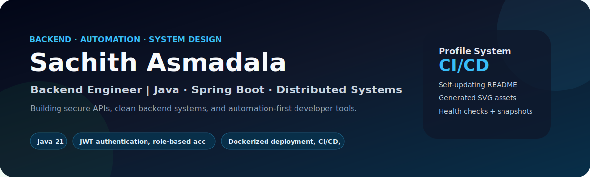
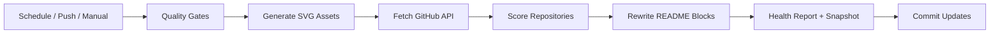

<div align="center">



<br/>

[](https://github.com/Sachith-02/Sachith-02/actions/workflows/update-profile.yml)
[](https://github.com/Sachith-02/Sachith-02/actions/workflows/validate-profile.yml)
[](https://github.com/Sachith-02/Sachith-02/actions/workflows/readme-lint.yml)
[](https://github.com/Sachith-02/Sachith-02/actions/workflows/codeql.yml)

[](https://www.linkedin.com/in/sachith-asmadala-3b185a333/)
[](https://github.com/Sachith-02)


### Backend Developer focused on secure APIs, clean architecture, distributed systems, and automation-first engineering

[About](#-about-me) · [Focus](#-professional-focus) · [Projects](#-featured-engineering-projects) · [Activity](#-recent-public-activity) · [Automation](#-automation-architecture) · [Health](#-repository-health-board)

</div>

---

<!-- ABOUT_ME_START -->
## 👋 About Me

I am **Sachith Asmadala**, a backend-focused developer from **Sri Lanka**. I build and improve repositories like real engineering products: clean code, secure APIs, CI workflows, documentation, and release-ready structure.

> This profile is designed as a professional portfolio, not a static README.

```java
record Developer(String focus, String mindset, String portfolioSystem) {}

var sachith = new Developer(
    "Java backend APIs + distributed systems",
    "Build cleanly, test clearly, automate repeatedly",
    "Self-updating GitHub profile powered by Actions"
);
```

<!-- ABOUT_ME_END -->

---

<!-- PROFILE_SUMMARY_START -->
## 🧠 Live Engineering Snapshot

| Metric | Value |
|---|---:|
| Public repositories scanned | Pending first automation run |
| Original projects | Pending first automation run |
| Total stars | Pending first automation run |
| Most used languages | Pending first automation run |
| Automation mode | Multi-workflow GitHub Actions |

<!-- PROFILE_SUMMARY_END -->

---

<!-- FOCUS_AREAS_START -->
## 🎯 Professional Focus

| Focus area | What I am building toward | Signal |
|---|---|---|
| Backend APIs | Secure, maintainable service layers and REST APIs | Java · Spring Boot · SQL |
| Automation | Repeatable profile and repository workflows | GitHub Actions · Python |
| Distributed Systems | Service design, messaging, reliability concepts | Docker · System Design |

<!-- FOCUS_AREAS_END -->

---

<!-- ENGINEERING_MATRIX_START -->
## 🧬 Engineering Matrix


| Area | Signal | Evidence |
|---|---:|---|
| Backend APIs | `███████████░` **92%** | Java 21, Spring Boot 3, REST, validation, layered architecture |
| Automation | `███████████░` **88%** | Docker, GitHub Actions, scheduled README generation |

<!-- ENGINEERING_MATRIX_END -->

---

## 🧰 Core Stack

<div align="center">


</div>

---

<!-- LANGUAGE_SUMMARY_START -->
## 📌 Language Intelligence

Repository language data will be calculated after the first automation run.

<!-- LANGUAGE_SUMMARY_END -->

---

<!-- PROJECT_STATUS_START -->
## ✅ Project CI & Release Status

| Repository | Status |
|---|---|
| Flagship repositories | CI and release badges are generated from `profile.config.json` |

<!-- PROJECT_STATUS_END -->

---

<!-- FEATURED_PROJECTS_START -->
## 🌟 Featured Engineering Projects

Project cards will be selected automatically from repository metadata and configured priority projects.

<!-- FEATURED_PROJECTS_END -->

---

<!-- PROJECTS_START -->
## 🚀 Repository Portfolio

Repository cards will be sorted by portfolio score after the automation workflow runs.

<!-- PROJECTS_END -->

---

<!-- REPO_HEALTH_START -->
## 🧪 Repository Health Board

| Repository | Language | Metadata | Score | Next improvement |
|---|---|---|---:|---|
| First automation run required | — | — | 0 | Run **Advanced Profile Automation** |

<!-- REPO_HEALTH_END -->

---

<!-- ACTIONS_DASHBOARD_START -->
## 🛰️ GitHub Actions Control Center

| Workflow | File | Trigger | Job |
|---|---|---|---|
| Advanced Profile Automation | `update-profile.yml` | Scheduled + manual | Regenerate dynamic profile sections |
| Profile Quality Gate | `validate-profile.yml` | Push + PR | Validate profile quality |
| README Lint | `readme-lint.yml` | Push + PR | Keep README clean and professional |

<!-- ACTIONS_DASHBOARD_END -->

---

<!-- ACTIVITY_START -->
## ⚡ Recent Public Activity

Public activity will appear here after the first scheduled or manual automation run.

<!-- ACTIVITY_END -->

---

<!-- ROADMAP_START -->
## 🗺️ Portfolio Upgrade Roadmap


| Stage | Goal | Deliverable |
|---|---|---|
| Now | Polish flagship repositories | Topics, CI badges, README diagrams, releases |
| Next | Strengthen backend case studies | API docs, Docker Compose, tests, architecture notes |
| Soon | Add distributed systems demos | Messaging, failure handling, system diagrams |

<!-- ROADMAP_END -->

---

## 📊 GitHub Intelligence

<div align="center">


<br/><br/>


<br/><br/>


</div>

---

<!-- AUTOMATION_ARCHITECTURE_START -->
## 🧱 Automation Architecture




<!-- AUTOMATION_ARCHITECTURE_END -->

---

<div align="center">

### Engineering standard I follow

**Readable code · Clear APIs · Tested changes · Documented architecture · Automated delivery**


</div>
