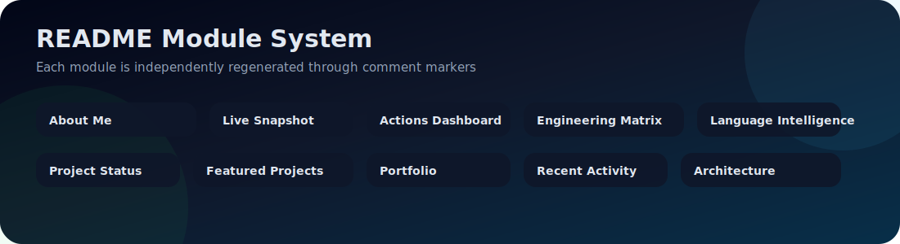
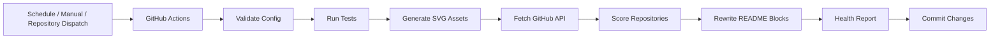

<div align="center">


[](https://git.io/typing-svg)

[](https://github.com/Sachith-02/Sachith-02/actions/workflows/update-profile.yml)
[](https://github.com/Sachith-02/Sachith-02/actions/workflows/test-profile-automation.yml)
[](https://github.com/Sachith-02/Sachith-02/actions/workflows/validate-profile.yml)
[](https://github.com/Sachith-02/Sachith-02/actions/workflows/generate-profile-assets.yml)

[](https://www.linkedin.com/in/sachith-asmadala-3b185a333/)
[](https://github.com/Sachith-02)


</div>

---

<div align="center">

### 🧭 Profile Navigation

[About](#-about-me) • [Live Snapshot](#-live-engineering-snapshot) • [Actions](#%EF%B8%8F-github-actions-control-center) • [Engineering Matrix](#-engineering-matrix) • [Languages](#-language-intelligence) • [Projects](#-featured-engineering-projects) • [Activity](#-recent-public-activity) • [Architecture](#-automation-architecture)

</div>

---


<!-- ABOUT_ME_START -->
## 👋 About Me

I am **Sachith Asmadala**, a backend-focused software engineering student/developer from **Sri Lanka**. My goal is to build projects that look and behave like real industry systems: clean code, secure APIs, documented architecture, repeatable deployment, and automated quality checks.

- 🔭 Building backend projects using **Java 21, Spring Boot 3, Docker, SQL databases, and GitHub Actions**
- 🧠 Exploring **distributed systems, RAG apps, parsers/compilers, messaging, and automation tools**
- 🧪 Turning repositories into **case studies** with architecture diagrams, CI badges, releases, and topic metadata
- ⚡ This README is designed as a mini automation platform, not only a static profile page

```java
record Developer(String focus, String mindset, String system) {}

var sachith = new Developer(
    "Backend APIs + distributed architecture",
    "Build deeply, test clearly, automate repeatedly",
    "Self-updating GitHub profile powered by Actions"
);
```

<!-- ABOUT_ME_END -->

<br clear="right"/>

---

<!-- PROFILE_SUMMARY_START -->
## 🧠 Live Engineering Snapshot

> This section will be regenerated from live GitHub API data.

| Metric | Value |
|---|---:|
| Public repositories scanned | Updating soon |
| Original projects | Updating soon |
| Forked projects | Updating soon |
| Total stars | Updating soon |
| Total forks | Updating soon |
| Most used languages | Updating soon |
| Automation mode | Multi-workflow GitHub Actions |
| Last automation run | Updating soon |

<!-- PROFILE_SUMMARY_END -->

---

<!-- ACTIONS_DASHBOARD_START -->
## 🛰️ GitHub Actions Control Center

> This profile uses several workflows instead of one simple script.

| Workflow | File | Trigger | Job |
|---|---|---|---|
| Advanced Profile Automation | `update-profile.yml` | Every 6 hours + manual | Regenerate README dynamic blocks |
| Profile Automation Tests | `test-profile-automation.yml` | Push + PR | Run unit tests |
| Profile Quality Gate | `validate-profile.yml` | Push + PR | Validate markers, scripts, config, and docs |
| Generate Profile Assets | `generate-profile-assets.yml` | Daily + manual | Build local SVG assets |
| Weekly Profile Maintenance | `weekly-profile-maintenance.yml` | Weekly + manual | Refresh README + health report |
| Release Profile Package | `release-profile-package.yml` | Version tag | Package profile automation release |

<!-- ACTIONS_DASHBOARD_END -->

---

<!-- ENGINEERING_MATRIX_START -->
## 🧬 Engineering Matrix


| Area | Signal | Evidence |
|---|---:|---|
| **Backend APIs** | `███████████░` **92%** | Java 21, Spring Boot 3, REST, validation, layered architecture |
| **Security** | `██████████░░` **84%** | JWT, Spring Security, RBAC, protected routes |
| **Data Layer** | `█████████░░░` **78%** | MySQL, PostgreSQL, migrations, repository patterns |
| **DevOps Automation** | `███████████░` **88%** | Docker, GitHub Actions, scheduled README generation |
| **Distributed Systems** | `█████████░░░` **74%** | Messaging, microservice thinking, fault-tolerance concepts |
| **Documentation** | `██████████░░` **86%** | Architecture diagrams, release playbook, project topics |

<!-- ENGINEERING_MATRIX_END -->

---

## 🧰 Core Tech Stack

<div align="center">

**Languages**  


**Backend & Security**  


**Database, Cloud Thinking & Automation**  


</div>

---

<!-- LANGUAGE_SUMMARY_START -->
## 📌 Language Intelligence

> This section will be automatically calculated from repository language data.

`Java` ░░░░░░░░░░ 0.0%  
`Python` ░░░░░░░░░░ 0.0%  
`C` ░░░░░░░░░░ 0.0%

<!-- LANGUAGE_SUMMARY_END -->

---

<!-- PROJECT_STATUS_START -->
## ✅ Project CI & Release Status

> Badges for flagship repositories will be generated from `profile.config.json`.

| Repository | Status |
|---|---|
| LibraCore | CI and release badge updating soon |
| Knowledge-Studio | CI and release badge updating soon |
| TaskLang | CI and release badge updating soon |
| Distributed_Systems_Group_30 | CI and release badge updating soon |

<!-- PROJECT_STATUS_END -->

---

## 🧭 Professional Project Assets



| Asset | Link | Why it matters |
|---|---|---|
| Architecture diagrams | [docs/architecture](docs/architecture) | Shows system design, not only code |
| Repository topic plan | [docs/REPOSITORY_TOPICS.md](docs/REPOSITORY_TOPICS.md) | Makes repository cards more professional |
| Release playbook | [docs/RELEASE_PLAYBOOK.md](docs/RELEASE_PLAYBOOK.md) | Helps repositories look maintained |
| CI workflow template | [docs/templates/ci.yml](docs/templates/ci.yml) | Copy-ready quality automation |
| Profile automation guide | [docs/AUTOMATION_GUIDE.md](docs/AUTOMATION_GUIDE.md) | Explains how the README updates itself |
| Health report | [docs/PROFILE_HEALTH_REPORT.md](docs/PROFILE_HEALTH_REPORT.md) | Tracks profile automation quality |

---

<!-- FEATURED_PROJECTS_START -->
## 🌟 Featured Engineering Projects

> This section is automatically selected from configured priority projects and live repository data.

Updating soon...

<!-- FEATURED_PROJECTS_END -->

---

<!-- PROJECTS_START -->
## 🚀 Repository Portfolio

> This portfolio is automatically sorted, scored, and regenerated using GitHub Actions.

Updating soon...

<!-- PROJECTS_END -->

---

<!-- REPO_HEALTH_START -->
## 🧪 Repository Health Board

> Repository health data will be generated after the first automation run.

| Repository | Language | Metadata | Score | Next improvement |
|---|---|---|---:|---|
| Updating soon | — | — | 0 | Run the automation workflow |

<!-- REPO_HEALTH_END -->

---

<!-- ACTIVITY_START -->
## ⚡ Recent Public Activity

Updating soon...

<!-- ACTIVITY_END -->

---

## 📊 GitHub Stats

<div align="center">


<br/><br/>


<br/><br/>


</div>

---

<!-- AUTOMATION_ARCHITECTURE_START -->
## 🧱 Automation Architecture




<!-- AUTOMATION_ARCHITECTURE_END -->

---

<div align="center">

### 🏆 GitHub Achievements

[](https://github.com/ryo-ma/github-profile-trophy)

<br/>

> *Good software is designed, tested, secured, documented, deployed, observed, and improved.*

</div>


