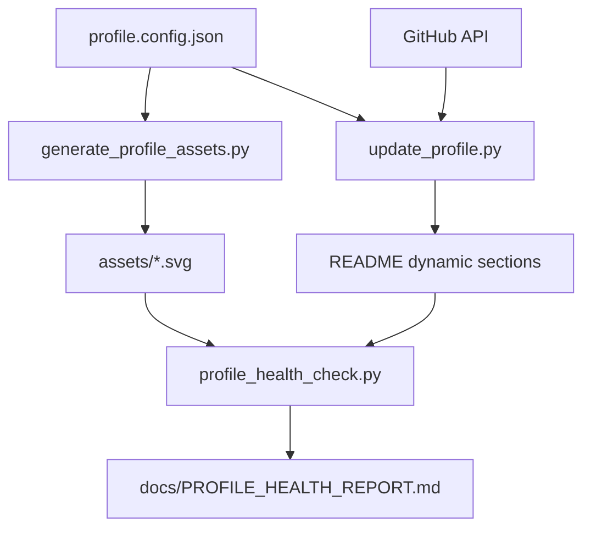

# Advanced Profile System Design

## System goal

Make the GitHub profile look like an engineering portfolio, not just a decorated README.

## Design principles

1. **Dynamic but controlled** — only marked blocks are rewritten.
2. **Visible automation** — the README shows the workflows that maintain it.
3. **Portfolio scoring** — repositories are ranked by useful engineering signals.
4. **Local assets** — SVG diagrams are generated and stored in the repo.
5. **Health reporting** — profile quality can be checked automatically.

## Data flow

## What makes it advanced

- Multiple workflows instead of one scheduled update.
- Unit tests for README generation functions.
- A matrix test workflow across Python versions.
- README marker validation.
- Generated SVG system diagrams.
- Repository health board.
- GitHub Actions dashboard inside the README.
- Release packaging workflow for the profile automation itself.
