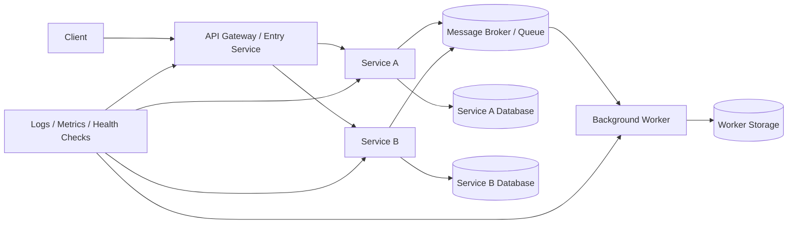
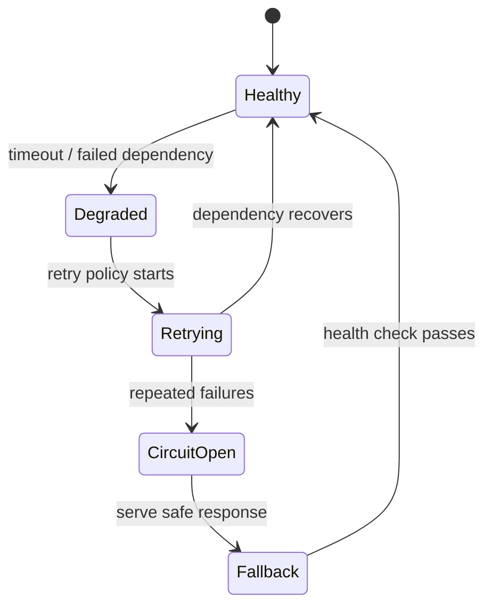

# Distributed Systems Group 30 Architecture

This diagram is useful when presenting distributed-systems coursework or backend experiments. It highlights service separation, message flow, health checks, and resilience.

## Failure-handling view

## README checklist for this repository

- Describe each service responsibility.
- Add local run commands.
- Add diagrams for message flow and failure recovery.
- Add test evidence or screenshots.
- Add CI badge and latest release badge.
