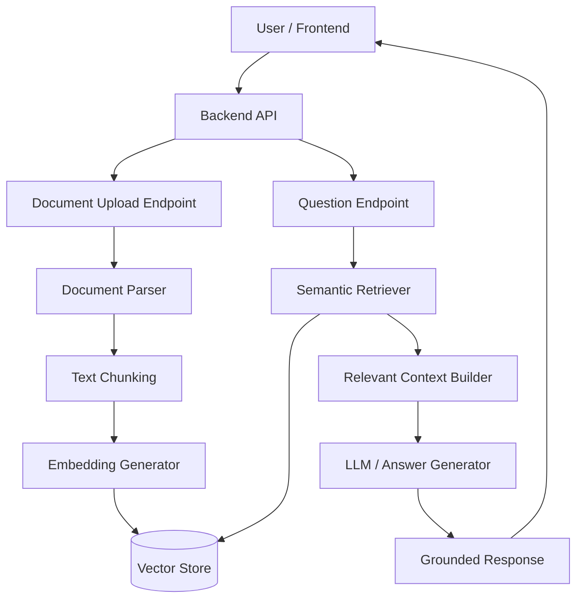
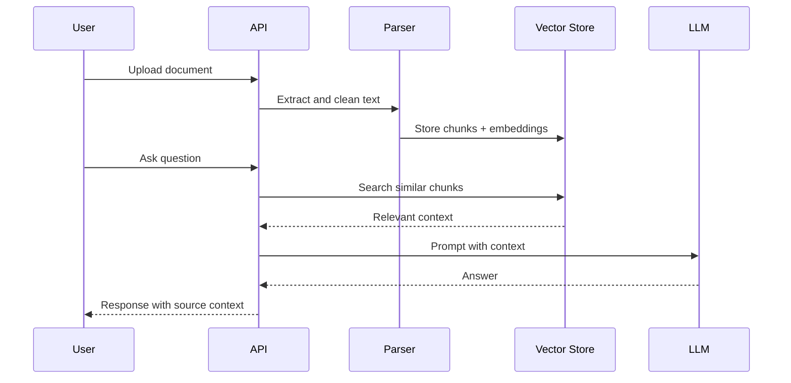

# Knowledge Studio Architecture

Knowledge Studio can be presented as an AI-assisted knowledge or RAG-style backend project. This diagram shows ingestion, indexing, retrieval, and answer generation as separate responsibilities.

## Data pipeline

## README checklist for this repository

- Explain supported file types.
- Show the ingestion pipeline.
- Add examples of prompts/questions.
- Document limitations, privacy, and token cost.
- Add CI badge and latest release badge.
