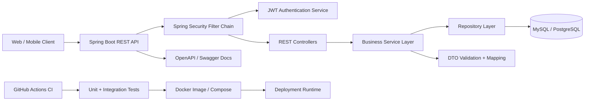
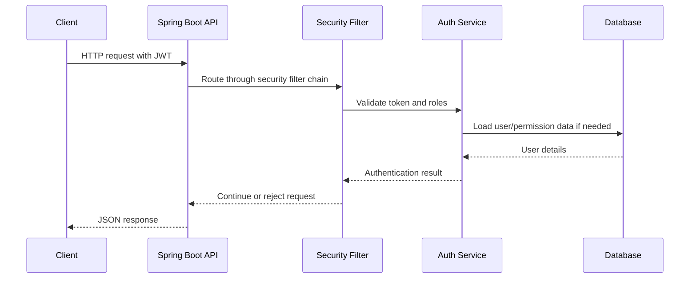

# LibraCore Architecture

LibraCore should be presented as a production-style backend project. The diagram below highlights clean API layering, JWT-based security, database access, and deployment automation.

## Request flow

## README checklist for this repository

- Add API setup steps.
- Add `.env.example`.
- Add database migration instructions.
- Add test command.
- Add Docker Compose command.
- Add CI badge and latest release badge.
